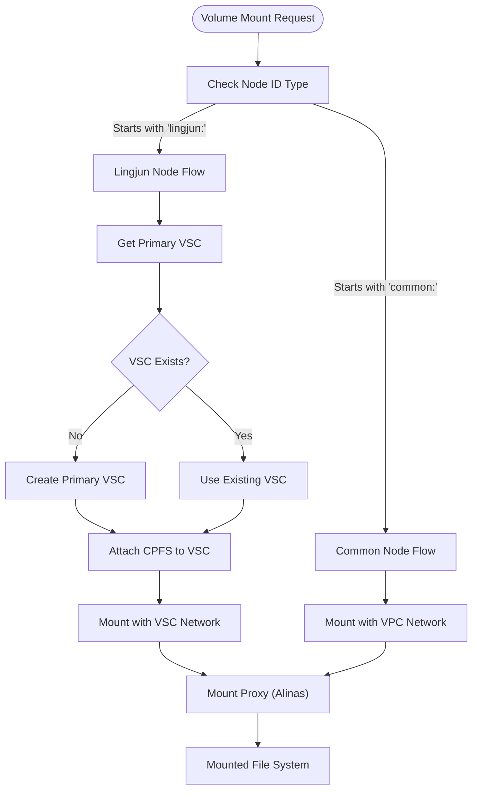

# BMCPFS Helm Integration Guide

## Overview

This guide provides comprehensive instructions for deploying and using BMCPFS through Helm charts in Kubernetes environments.

## Features

- **High-Performance Parallel File System**: Optimized for high I/O workloads
- **Dual Network Support**: VSC for high performance, VPC for compatibility
- **Shared Access**: ReadWriteMany support for multi-node concurrent access
- **Lingjun Infrastructure Optimization**: Automatic node type detection and network optimization

## Prerequisites

### Infrastructure Requirements

1. **Kubernetes Cluster**: Version 1.20 or higher
2. **Helm**: Version 3.0 or higher
3. **Network Infrastructure**:
   - Lingjun infrastructure with VSC networking (recommended for optimal performance)
   - Standard VPC infrastructure (fallback support)
4. **BMCPFS**: Pre-created Cloud Parallel File System in Alibaba Cloud, submit a ticket to enable bmcpfs openapi.

### Authentication Requirements

- Proper IAM roles for accessing Alibaba Cloud APIs, and configure permissions to access NAS and EFLO services. The required permissions list is as follows, and the secret key with this permission needs to be associated with csi-provisioner.

```json
{
  "Version": "1",
  "Statement": [
    {
      "Action": [
        "nas:DescribeFileSystems",
        "nas:DescribeMountTargets",
        "nas:CreateMountTarget",
        "nas:DeleteMountTarget",
        "nas:ModifyMountTarget",
        "nas:DescribeProtocolMountTarget",
        "nas:AttachVscToFilesystems",
        "nas:DetachVscFromFilesystems",
        "nas:DescribeFilesystemsVscAttachInfo",
        "nas:DescribeAccessPoints"
      ],
      "Resource": [
        "*"
      ],
      "Effect": "Allow"
    },
    {
      "Effect": "Allow",
      "Action": [
        "eflo:DescribeVsc",
        "eflo:ListVscs"
      ],
      "Resource": "*"
    }
  ]
}
```

## Installation

### Step 1: Prepare Configuration

Create a custom values file for your environment. For Lingjun infrastructure deployment:

```bash
# Create values-custom.yaml based on Lingjun profile
cat > values-custom.yaml << EOF
csi:
  bmcpfs:
    enabled: true
    controller:
      enabled: true
  disk:
    enabled: false  # Disable other storage types
  nas:
    enabled: false
  oss:
    enabled: false

deploy:
  regionID: "cn-hangzhou"  # Your region
  ramToken: v2
  ecs: false  # For Lingjun bare metal
  accessKey:
    enabled: true
    secretName: alibaba-addon-secret # Alibaba Cloud secret key for accessing openapi, permissions listed above
    idKey: access-key-id # access-key-id in secret
    secretKey: access-key-secret # access-key-secret in secret
  newProvisionerToken: false

controller:
  enabled: true
  replicas: 2

images:
  controller:
    repo: acs/csi-plugin
    tag: "v1.33.4-576836c-aliyun"
  plugin:
    repo: acs/csi-plugin
    tag: "v1.33.4-576836c-aliyun"
EOF
```

### Step 2: Install the CSI Driver

```bash
helm install bmcpfs-csi-driver \
  ./deploy/charts/alibaba-cloud-csi-driver \
  -f values-custom.yaml \
  --namespace kube-system
```

### Step 3: Install cnfs-nas-daemon Component

```yaml
apiVersion: apps/v1
kind: DaemonSet
metadata:
  name: cnfs-nas-daemon
  namespace: cnfs-system
spec:
  revisionHistoryLimit: 10
  selector:
    matchLabels:
      app: cnfs-nas-daemon
  template:
    metadata:
      creationTimestamp: null
      labels:
        app: cnfs-nas-daemon
        app.kubernetes.io/managed-by: Helm
        app.kubernetes.io/version: 0.1.0
        helm.sh/chart: cnfs-nas-daemon-0.1.4
    spec:
      affinity:
        nodeAffinity:
          requiredDuringSchedulingIgnoredDuringExecution:
            nodeSelectorTerms:
              - matchExpressions:
                  - key: type
                    operator: NotIn
                    values:
                      - virtual-kubelet
      containers:
        - args:
            - '--socket=/run/cnfs/alinas-mounter.sock'
            - '--driver=alinas'
          image: >
            registry-us-west-1-vpc.ack.aliyuncs.com/acs/csi-alinas:v2.0-2a209ad-aliyun # Image address needs to be changed to current cluster region address
          imagePullPolicy: IfNotPresent
          name: mount-proxy
          resources:
            limits:
              cpu: '1'
            requests:
              cpu: 500m
              memory: 1Gi
          securityContext:
            privileged: true
          terminationMessagePath: /dev/termination-log
          terminationMessagePolicy: File
          volumeMounts:
            - mountPath: /dev
              mountPropagation: HostToContainer
              name: host-dev
            - mountPath: /var/lib/kubelet
              mountPropagation: Bidirectional
              name: kubelet-dir
            - mountPath: /run/cnfs
              name: cnfs-dir
            - mountPath: /etc/aliyun/cpfs
              name: etc-dir
              subPath: cpfs
            - mountPath: /etc/aliyun/alinas
              name: etc-dir
              subPath: alinas
            - mountPath: /var/log/aliyun/cpfs
              name: log-dir
              subPath: cpfs
            - mountPath: /var/log/aliyun/alinas
              name: log-dir
              subPath: alinas
            - mountPath: /var/run/alinas
              name: cnfs-dir
              subPath: alinas
            - mountPath: /var/run/cpfs
              name: cnfs-dir
              subPath: cpfs
            - mountPath: /var/run/efc
              name: cnfs-dir
              subPath: efc
            - mountPath: /etc/hosts
              name: hosts
      dnsPolicy: ClusterFirst
      hostIPC: true
      hostNetwork: true
      priorityClassName: system-node-critical
      restartPolicy: Always
      schedulerName: default-scheduler
      securityContext: {}
      serviceAccount: cnfs-nas-daemon
      serviceAccountName: cnfs-nas-daemon
      terminationGracePeriodSeconds: 30
      tolerations:
        - operator: Exists
      volumes:
        - hostPath:
            path: /var/lib/kubelet
            type: ''
          name: kubelet-dir
        - hostPath:
            path: /dev
            type: ''
          name: host-dev
        - hostPath:
            path: /run/cnfs
            type: DirectoryOrCreate
          name: cnfs-dir
        - hostPath:
            path: /etc/cnfs
            type: DirectoryOrCreate
          name: etc-dir
        - hostPath:
            path: /var/log/cnfs
            type: DirectoryOrCreate
          name: log-dir
        - hostPath:
            path: /run/cnfs/alinas.hosts
            type: FileOrCreate
          name: hosts
  updateStrategy:
    type: OnDelete
```

### Step 4: Verify Installation

```bash
# Check CSI driver registration
kubectl get csidriver bmcpfsplugin.csi.alibabacloud.com

# Verify controller deployment
kubectl get deployment -n kube-system -l app=csi-provisioner

# Check node plugin daemonset
kubectl get daemonset -n kube-system -l app=cnfs-nas-daemon

# Check cnfs-nas-daemon node plugin
kubectl get daemonset -n cnfs-system -l app=csi-plugin

# Verify pod status
kubectl get pods -n kube-system | grep csi
```

Expected output should show:
- CSI driver `bmcpfsplugin.csi.alibabacloud.com` registered
- Controller pods running (2 replicas by default)
- Node plugin pods running on all nodes

## Configuration

### StorageClass Configuration

Create a StorageClass to define how BMCPFS volumes should be provisioned:

```yaml
apiVersion: storage.k8s.io/v1
kind: StorageClass
metadata:
  name: bmcpfs-sc
provisioner: bmcpfsplugin.csi.alibabacloud.com
parameters:
  # CPFS file system configuration
  fileSystemId: "cpfs-xxxxxxxxx"
  vscMountTarget: "cpfs-xxxxxxxxx-vsc.cn-hangzhou.cpfs.nas.aliyuncs.com"
  vpcMountTarget: "cpfs-xxxxxxxxx-vpc.cn-hangzhou.cpfs.nas.aliyuncs.com"
  path: "/shared"  # Optional subpath within the file system
reclaimPolicy: Retain
allowVolumeExpansion: false
volumeBindingMode: Immediate
```

### StorageClass Parameters

| Parameter | Description | Required | Example |
|-----------|-------------|----------|---------|
| `fileSystemId` | CPFS file system identifier | Yes | `cpfs-xxxxxxxxx` |
| `vscMountTarget` | VSC network mount target | Yes | `cpfs-xxx-vsc.region.cpfs.nas.aliyuncs.com` |
| `vpcMountTarget` | VPC network mount target | Yes | `cpfs-xxx-vpc.region.cpfs.nas.aliyuncs.com` |
| `path` | Subpath within file system | No | `/data`, `/shared` |

Apply the StorageClass:

```bash
kubectl apply -f storageclass.yaml
```

## Usage

### Static Volume Provisioning

For pre-existing CPFS file systems, create a static PersistentVolume:

```yaml
apiVersion: v1
kind: PersistentVolume
metadata:
  name: bmcpfs-static-pv
spec:
  capacity:
    storage: 500Gi
  accessModes:
    - ReadWriteMany
  persistentVolumeReclaimPolicy: Retain
  csi:
    driver: bmcpfsplugin.csi.alibabacloud.com
    volumeHandle: "bmcpfs-xxxxxx"
    volumeAttributes:
      vscMountTarget: "cpfs-xxxxxxxxx-vsc.cn-hangzhou.cpfs.nas.aliyuncs.com"
      vpcMountTarget: "cpfs-xxxxxxxxx-vpc.cn-hangzhou.cpfs.nas.aliyuncs.com"
---
apiVersion: v1
kind: PersistentVolumeClaim
metadata:
  name: bmcpfs-static-pvc
  namespace: default
spec:
  accessModes:
    - ReadWriteMany
  resources:
    requests:
      storage: 500Gi
  volumeName: bmcpfs-static-pv
```

### Using BMCPFS in Pods

Deploy a pod that uses the BMCPFS volume:

```yaml
apiVersion: v1
kind: Pod
metadata:
  name: bmcpfs-test-pod
  namespace: default
spec:
  containers:
    - name: app
      image: nginx:latest
      volumeMounts:
        - name: bmcpfs-volume
          mountPath: /data
          mountPropagation: Bidirectional
      command:
        - "/bin/sh"
        - "-c"
        - "echo 'Hello BMCPFS' > /data/test.txt && tail -f /data/test.txt"
  volumes:
    - name: bmcpfs-volume
      persistentVolumeClaim:
        claimName: bmcpfs-static-pvc
  nodeSelector:
    # Target Lingjun nodes for optimal performance (if available)
    node-type: lingjun
```

### Multi-Pod Shared Access

BMCPFS supports ReadWriteMany, allowing multiple pods to access the same volume simultaneously:

```yaml
apiVersion: apps/v1
kind: Deployment
metadata:
  name: bmcpfs-shared-app
spec:
  replicas: 3
  selector:
    matchLabels:
      app: shared-app
  template:
    metadata:
      labels:
        app: shared-app
    spec:
      containers:
        - name: app
          image: nginx:latest
          volumeMounts:
            - name: shared-storage
              mountPath: /shared
      volumes:
        - name: shared-storage
          persistentVolumeClaim:
            claimName: bmcpfs-static-pvc
```

## Network Type Detection

The BMCPFS driver automatically detects the appropriate network type based on node configuration:

### Lingjun Nodes
- **Network Type**: VSC
- **Performance**: Optimized for high-throughput, low-latency access

### Standard Nodes
- **Network Type**: VPC
- **Compatibility**: Standard cloud infrastructure support

## Mount Process Flow



## Upgrade to New Version

```bash
helm upgrade bmcpfs-csi-driver \
  ./deploy/charts/alibaba-cloud-csi-driver \
  -f backup-values.yaml \
  --namespace kube-system
```

## Verify Upgrade

```bash
kubectl rollout status deployment/csi-provisioner -n kube-system
kubectl rollout status daemonset/csi-plugin -n kube-system
```

## Uninstall

```bash
# First delete all PVCs
kubectl delete pvc --all -A

# Uninstall Helm release
helm uninstall bmcpfs-csi-driver -n kube-system

# Uninstall cnfs-nas-daemon component
kubectl delete daemonset cnfs-nas-daemon -n cnfs-system

# Clean up CSI driver registration
kubectl delete csidriver bmcpfsplugin.csi.alibabacloud.com

# Verify cleanup
kubectl get pods -n kube-system | grep csi
```

## Coexistence

BMCPFS can coexist with other CSI drivers:

```yaml
csi:
  bmcpfs:
    enabled: true
  nas:
    enabled: true  # Keep NAS for compatibility
  disk:
    enabled: true  # Keep disk for block storage
```

## Support and Community

- **Issues**: Report issues at [GitHub Issues](https://github.com/kubernetes-sigs/alibaba-cloud-csi-driver/issues)
- **Documentation**: Refer to main [project documentation](../README.md)
- **Community**: Join DingDing Group (ID: 33936810) for discussions

## Security

Report security vulnerabilities to kubernetes-security@service.aliyun.com

## License

This project is licensed under the Apache License 2.0 - see the [LICENSE](../LICENSE) file for details.