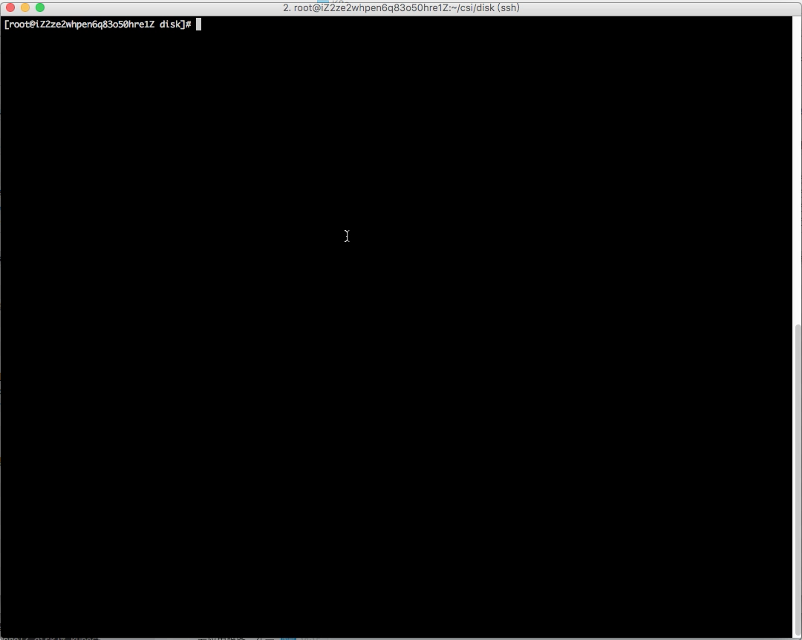

## Disk CSI Plugin

An Disk CSI plugin is available to help simplify storage management.
Once user creates PVC with the reference to a Disk storage class, disk and
corresponding PV object gets dynamically created and becomes ready to be used by
workloads.

CSI plugin supports disk snapshot now, you can refer to [disk-snapshot](./disk-snapshot.md)

## Configuration Requirements

* Secret object with the authentication key for Disk
* StorageClass with diskplugin (default diskplugin.csi.alibabacloud.com name) as a provisioner name and information about disk(zoneId, regionId, type)
* Service Accounts with required RBAC permissions

## Feature Status
Alpha

## Compiling and Package
diskplugin.csi.alibabacloud.com can be compiled in a form of a container.

To build a container:
```
$ cd build && sh build-disk.sh
```

## Demo

[](http://cloud.video.taobao.com/play/u/1962692024/p/1/e/6/t/1/50224108448.mp4)


## Usage

### Prerequisite

You can create a Kubernetes Cluster on [Alibaba cloud Container Service](https://help.aliyun.com/product/25972.html?spm=a2c4g.750001.2.3.A7g9FZ)

### Step 1: Create CSI disk-plugin
If the cluster not in STS mode, you need to config AK info to plugin; Set ACCESS_KEY_ID, ACCESS_KEY_SECRET to environment;


```
# kubectl create -f ./deploy/disk/disk-plugin.yaml
```

> Note: The plugin log style can be configured by environment variable: LOG_TYPE.

> "host": logs will be printed into files which save to host(/var/log/alicloud/diskplugin.csi.alibabacloud.com.log);

> "stdout": default option, logs will be printed to stdout, can be printed by docker logs or kubectl logs.

### Step 2: Create CSI external runner
```
# kubectl create -f ./deploy/disk/disk-external-runner.yaml
```

### Step 3: Create StorageClass
```
# kubectl create -f ./deploy/disk/storageclass.yaml
```
**Important:** storageclass.yaml, must be customized to match your environment: zoneId, zoneId;

### Step 4: Check Status of CSI plugin
```
# kubectl get pods | grep csi
```

The following output should be displayed:

```
# kubectl get pod
NAME                    READY   STATUS    RESTARTS   AGE
csi-diskplugin-2pm2k    2/2     Running   0          8m
csi-diskplugin-4bvgz    2/2     Running   0          8m
csi-diskplugin-w2n7s    2/2     Running   0          8m
csi-external-runner-disk-0   3/3     Running   0          8m
```

### Step 7: Create PVC & Deployments
```
# kubectl create -f ./deploy/disk/deploy.yaml
```

### Step 8: Check status of PVC/PV
```
# kubectl get pvc
NAME       STATUS    VOLUME                                     CAPACITY   ACCESS MODES   STORAGECLASS           AGE
disk-pvc   Bound     pvc-64b3d1bd-96c0-11e8-89b1-00163e0c412f   25Gi       RWO            csi-disk               36m
```

```
# kubectl get pv
NAME                                       CAPACITY   ACCESS MODES   RECLAIM POLICY   STATUS        CLAIM                 STORAGECLASS               REASON    AGE
pvc-64b3d1bd-96c0-11e8-89b1-00163e0c412f   25Gi       RWO            Delete           Terminating   default/disk-pvc      csi-disk                             35m
```

```
# kubectl describe pv pvc-64b3d1bd-96c0-11e8-89b1-00163e0c412f
Name:            pvc-64b3d1bd-96c0-11e8-89b1-00163e0c412f
Labels:          <none>
Annotations:     pv.kubernetes.io/provisioned-by=diskplugin.csi.alibabacloud.com
Finalizers:      [kubernetes.io/pv-protection external-attacher/diskplugin.csi.alibabacloud.com]
StorageClass:    csi-disk
Status:          Terminating (lasts 2m)
Claim:           default/disk-pvc
Reclaim Policy:  Delete
Access Modes:    RWO
Capacity:        25Gi
Node Affinity:   <none>
Message:
Source:
    Type:          CSI (a Container Storage Interface (CSI) volume source)
    Driver:        diskplugin.csi.alibabacloud.com
    VolumeHandle:  d-2ze47lce65lv5g7zsb4y
    ReadOnly:      false
Events:            <none>
```

#### Step 9: Check status of Deployment
```
# kubectl get pod
NAME                                 READY     STATUS    RESTARTS   AGE
nginx-deployment1-5879d9db88-49n8m   1/1       Running   0          37m
```
