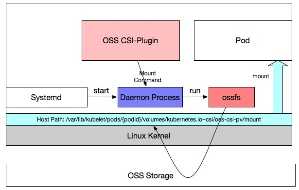

## Description:

When restart oss csi-plugin, the ossfs connection will be reconnect, and the mount point in pod will be useless.

Access mountpoint will get error:

	"transport endpoint is not connected"

Issue Details: [https://github.com/AliyunContainerService/csi-plugin/issues/22](https://github.com/AliyunContainerService/csi-plugin/issues/22)

This is a common issue for FUSE type csi-plugin, and no good solution now.

Kubernetes Issue Track: [https://github.com/kubernetes/kubernetes/issues/70013](https://github.com/kubernetes/kubernetes/issues/70013)

## Solution

This solution is for Alibabacloud oss volume, and not for all FUSE plugin.

OSS CSI-Plugin Basic:

```
1. Use ossfs to mount oss bucket to local host;

2. Ossfs is running in the host namespaces, not in CSI pod;

3. Upgrade csi-plugin will renew oss csi-plugin pod, and all process created from csi-plugin will be killed.
```

Design:

```
1. Add a daemon running in the host, and be responsible to accept and run command(Shell script).

2. Not csi-plugin do the ossfs running action, it sends message(command) to daemon which is running on the same host.

3. Csi-plugin communicate with daemon by unix socket;

4. Daemon not be startup by csi-plugin or other pods, it is raised up by kubelet;

5. Consider flexvolume init implementation. When csi-plugin startup, it install a flexvolume and the flexvolume "init" interface will be called.

6. Flexvolume Init interface is to startup the daemon process.

7. Daemon process runs ossfs command with "systemd-run --scope", which can continue the connection when daemon restart.
```



## Test

### 1. Create Pod using oss volume:

```
# kubectl get pod
NAME                        READY   STATUS    RESTARTS   AGE
csi-external-runner-oss-0   1/1     Running   0          2d23h
csi-ossplugin-2lsqm         2/2     Running   0          143m
csi-ossplugin-k6mhv         2/2     Running   0          143m
csi-ossplugin-wc4r5         2/2     Running   0          143m

# kubectl create -f deploy.yaml
deployment.apps/nginx-deployment created

# kubectl get pod
NAME                               READY   STATUS    RESTARTS   AGE
csi-external-runner-oss-0          1/1     Running   0          2d23h
csi-ossplugin-2lsqm                2/2     Running   0          144m
csi-ossplugin-k6mhv                2/2     Running   0          144m
csi-ossplugin-wc4r5                2/2     Running   0          144m
nginx-deployment-7d7d7447f-n2mjv   1/1     Running   0          20s
```

### 2. Check oss mount path:

```
# kubectl exec -ti nginx-deployment-7d7d7447f-n2mjv sh
# ls data
test
# mount | grep oss
ossfs on /data type fuse.ossfs (rw,nosuid,nodev,relatime,user_id=0,group_id=0,allow_other)
```

### 3. Delete oss csi-plugin pods(upgrade):

```
# kubectl delete pod csi-ossplugin-2lsqm csi-ossplugin-k6mhv csi-ossplugin-wc4r5
pod "csi-ossplugin-2lsqm" deleted
pod "csi-ossplugin-k6mhv" deleted
pod "csi-ossplugin-wc4r5" deleted

# kubectl get pod
NAME                               READY   STATUS    RESTARTS   AGE
csi-external-runner-oss-0          1/1     Running   0          2d23h
csi-ossplugin-9r5dx                2/2     Running   0          39s
csi-ossplugin-qs5fb                2/2     Running   0          45s
csi-ossplugin-w66w6                2/2     Running   0          43s
nginx-deployment-7d7d7447f-n2mjv   1/1     Running   0          2m17s
```

> Check the oss mount path:

```
# kubectl exec -ti nginx-deployment-7d7d7447f-n2mjv sh
# ls data
test
# mount | grep oss
ossfs on /data type fuse.ossfs (rw,nosuid,nodev,relatime,user_id=0,group_id=0,allow_other)
```

### 4. Restart kubelet on the host(oss pod running on it):

```
# mount | grep oss
ossfs on /var/lib/kubelet/pods/4f2de2c4-4ed3-11e9-983f-00163e0b8d64/volumes/kubernetes.io~csi/oss-csi-pv/mount type fuse.ossfs (rw,nosuid,nodev,relatime,user_id=0,group_id=0,allow_other)
# service kubelet restart
Redirecting to /bin/systemctl restart kubelet.service
```

> Check the oss mount path:

``` 
# kubectl exec -ti nginx-deployment-7d7d7447f-n2mjv sh
# ls data
test
# mount | grep oss
ossfs on /data type fuse.ossfs (rw,nosuid,nodev,relatime,user_id=0,group_id=0,allow_other)
```
